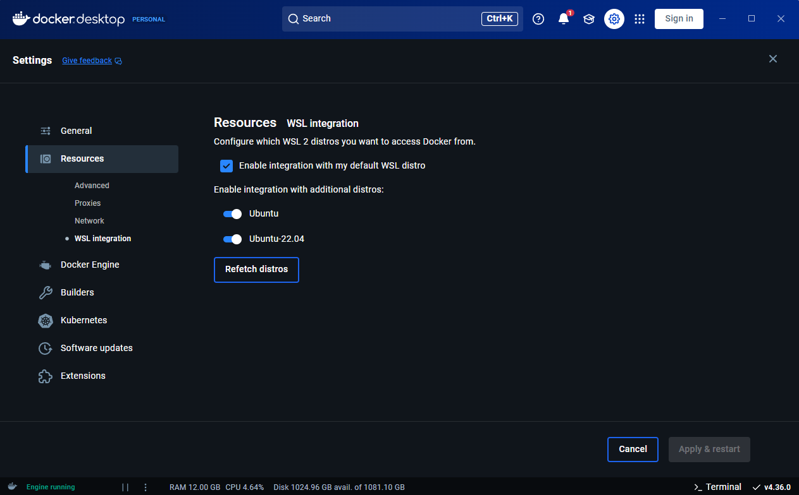

# BBB-Translation-Bot

BBB-Translation-Bot is a tool designed to enhance communication in BigBlueButton (BBB) meetings by providing real-time transcription and translation services. Utilizing OpenAI's cutting-edge [Whisper](https://github.com/openai/whisper) technology, the bot joins a BBB meeting's audio channel and transcribes/translates spoken words into text, seamlessly integrating the transcripts into BBB's closed captions feature.

# Getting Started

First of all you need the right Haardware. Im using a [NVIDIA RTX4090](https://www.nvidia.com/de-de/geforce/graphics-cards/40-series/rtx-4090/). Where I get a stable transcription speed of 2,1 seconds in english with the large-v3 version of Whisper. And thats it. Now lets staart with the softwaare part. Dont worry. I will go through the whole process stepo by step. Also you dont have to install any drivers. I will show you how to do this. You just need a fresh installation of Ubuntu22 and root access. And dont be to ambitious and clone this project in advance. We will do this together. Just keep reading and dont skip any steps.

For both parth I recomend using [Ubuntu22](https://releases.ubuntu.com/jammy/). At the moment Im using Faster Whisper which needs cuDNN 8.x. And this is only supported on Ubuntu22. I also recomend using Proxmox to setup a virtual mashin with ubuntu22. Im showing you how to to this with GPU pathtrough on this README-proxmox.md

You now have to options. You can get this up and running using docker, or setup an dev environment and run it with docker or normal in multiple screen seasions.

There are two ways in getting started. If you just want to get this project up and running continue reading here.
If you want to setup aa developer environment continue reaading here.

## Simple setup (no dev!!!)

I have provided a makefile to make the setup process easier. You can run the following commands to get the project up and running.

```bash
git clone https://github.com/bigbluebutton-bot/bbb-translation-bot
cd bbb-translation-bot
sudo make simple-setup
```

This will do the following:
- Update System Packages
- Install nvidia drivers
- Reboot the system
- Install docker
- Install docker with nvidia support

The script will reboot the system. Dont worry. It will automaticly continue after the reboot. To see the status of the script after the reboot you can run the following command:

```bash
sudo su
screen -r 
```

If the setup script is completed you can run the following command to start the bot:

```bash
make start
```

Because this will be the first time starting the bot it will detect, there is no '.env' file. So it will ask you some questions to be able to connect to your BigBlueButton server. You will need the domain and the BBB sectet. To get the secret ssh into you BBB server and run:
    
    ```bash
    sudo bbb-conf --secret
    ```

## Developer setup

If you want to develop on Windows WSL. This is ppossible. Continue reading at the WSL section.

If you want to setup a developer environment you can run the following commands:

```bash
git clone --recurse-submodules -j8 https://github.com/bigbluebutton-bot/bbb-translation-bot
cd bbb-translation-bot
sudo make dev-setup
```

This will do the following:
- Update System Packages
- Install NVIDIA Drivers
- Install NVIDIA CUDA
- Reboot
- Install NVIDIA cuDNN 8.9.7
- Install Docker
- Install golang
- Install python3

The script will reboot the system. Dont worry. It will automaticly continue after the reboot. To see the status of the script after the reboot you can run the following command:

```bash
sudo su
screen -r 
```


## WSL

If you want to develop on Windows WSL. This is possible. You can follow the following steps to get the project up and running.

1. Install your [NVIDIA drivers](https://www.nvidia.com/en-us/drivers/) on your Windows machine. Accouding to this [article](https://docs.nvidia.com/cuda/wsl-user-guide/index.html#getting-started-with-cuda-on-wsl) WSL 2 should then have access to the drivers.
2. Install WSL2. Fo that open PowerShell as an administrator and run the following command:

    ```bash
    wsl --install
    ```

3. Install Ubuntu22. You can do this by opening the [Microsoft Store](https://apps.microsoft.com/detail/9pn20msr04dw) and searching for Ubuntu22. Click on install and wait for the installation to complete.
4. Go and downloade docker desktop from the [docker website](https://www.docker.com/products/docker-desktop). Install it and make sure to enable the WSL2 integration. Now open the Ubuntu22 terminal and try running the `docker` command.

<details>
  <summary>Fix for error: `The command 'docker' could not be found in this WSL 2 distro.`</summary>
    If you get an error like this:

    ```bash
    $ docker

    The command 'docker' could not be found in this WSL 2 distro.
    We recommend to activate the WSL integration in Docker Desktop settings.

    For details about using Docker Desktop with WSL 2, visit:

    https://docs.docker.com/go/wsl2/
    ```

    Open docker desktop and go to settings. Then go to the resources tab and click on WSL integration. Enable the integration for Ubuntu22.
    

    Thanks to this [post](https://stackoverflow.com/questions/63497928/ubuntu-wsl-with-docker-could-not-be-found).
</details>


5. Open the Ubuntu22 terminal and run the following command to update the system:

    ```bash
    git clone --recurse-submodules -j8 https://github.com/bigbluebutton-bot/bbb-translation-bot
    cd bbb-translation-bot
    sudo make dev-setup-wsl


    sudo apt install nvidia-cuda-dev -y
    sudo apt install nvidia-cuda-toolkit -y

    ```